# Дмитрий Руденко

### Lead Backend Developer

Руковожу backend-разработкой и проектирую сервисы на Java / Kotlin и Spring.  
Фокус — надёжная архитектура, delivery и развитие команды.

**Специализация:** Java · Kotlin · Spring  
**Роль:** Lead Backend  
**Локация:** Россия · Remote  

🌐 [Портфолио (GitHub Pages)](https://fso13.github.io/fso13/)

---

## Опыт работы

### Февраль 2024 — н.в.

**Lead Backend**, [РТК ИТ](https://rtkit.ru/)

Поддержка и разработка сервисов экосистемы Лукоморье.

- Управление backend-командой: постановка целей, распределение нагрузки, 1:1 и развитие людей
- Синхронизация с продукт-оунерами и смежными командами, согласование приоритетов и сроков
- Планирование релизов, контроль delivery и прозрачная отчётность по статусу работ
- Найм и онбординг разработчиков, формирование компетенций и зоны ответственности в команде
- Выстраивание процессов разработки: код-ревью, DoD, ритуалы спринта, качество поставки
- Проектирование и разработка системы плагинов для расширения экосистемы без изменения ядра
- Определение контрактов плагинов, жизненного цикла подключения и изоляции расширений

**Стек:** Java 17, Kotlin, Spring 5–6, Hibernate, PostgreSQL, RabbitMQ, Kafka, OAuth 2.0

---

### Ноябрь 2021 — февраль 2024

**Lead Java Developer**, [Банк Открытие](https://www.open.ru)

Поддержка и разработка бизнес-портала для клиентов МСБ.

- Архитектурные решения и декомпозиция задач по backend-сервисам портала
- Код-ревью, менторинг команды и контроль качества кода
- Планирование спринтов, оценка сроков и приоритизация бэклога с бизнесом
- Проектирование интеграций (REST, SOAP, messaging) и согласование контрактов API
- Разбор инцидентов в проде, анализ узких мест и оптимизация производительности
- Онбординг разработчиков и выравнивание практик команды (Gitflow, CI, стандарты кода)

**Стек:** Java 8, Spring 5, Hibernate, PostgreSQL, REST, WebSocket, ActiveMQ, Tibco, SOAP

---

### Май 2018 — ноябрь 2021

**Java Developer**, [RooX Solutions](https://www.roox.ru)

Backend-разработка на Spring-стеке: REST, messaging, интеграции.

- Реализация нового функционала для собственного продукта SSO
- Участие в разработке системы ДБО

**Стек:** Java 8, Spring 5, Hibernate, PostgreSQL, REST, WebSocket, ActiveMQ, SOAP, Vagrant

---

### Май 2013 — апрель 2018

**Java Developer**, [ООО «СИТ Консалтинг»](https://citc.ru)

- Поддержка и разработка платформы рассылки SMS, голосовых сообщений и писем
- Разработка платформы интеграции с платёжными системами
- Серверная система для мобильного приложения коллекторского бюро
- Разработка интеграций на основе технологии OSGi
- Разработка интеграции с Яндекс Такси
- Разработка системы предотвращения нелегальных поездок таксистов

**Стек:** Java 8, Spring, Spring Dynamic Modules, Blueprint, EclipseLink, JDO, DataNucleus, MyBatis, JDBC, PostgreSQL, Oracle, MS SQL, Apache Drools, SOAP, JMS, WebSocket, ActiveMQ, OpenMQ, Vaadin, OSGi / Karaf, Camel

---

## Основной стек

| Направление | Технологии |
|---|---|
| Languages | Java 17 · Kotlin |
| Framework | Spring Boot / Security / Data |
| Data | PostgreSQL · Hibernate |
| Messaging | Kafka · RabbitMQ |
| API | REST · OAuth 2.0 |
| Delivery | Git · Maven / Gradle |

---

## Образование

**2006 — 2011**  
Волгоградский государственный технический университет  
Автоматизированные системы обработки информации и управления

---

## GitHub

---

## Контакты

- **Email:** [dimarudenk@gmail.com](mailto:dimarudenk@gmail.com)
- **GitHub:** [github.com/fso13](https://github.com/fso13)

---

## Технологии и стек

Java · Kotlin · Spring · Hibernate · PostgreSQL · Oracle · MS SQL · Kafka · RabbitMQ · ActiveMQ · OpenMQ · JMS · MyBatis · JDO · DataNucleus · JDBC · EclipseLink · Drools · Camel · Vaadin · OSGi / Karaf · Spring DM · Blueprint · OAuth 2.0 · REST · SOAP · WebSocket · Git · Maven · Gradle · Vagrant · Tibco
